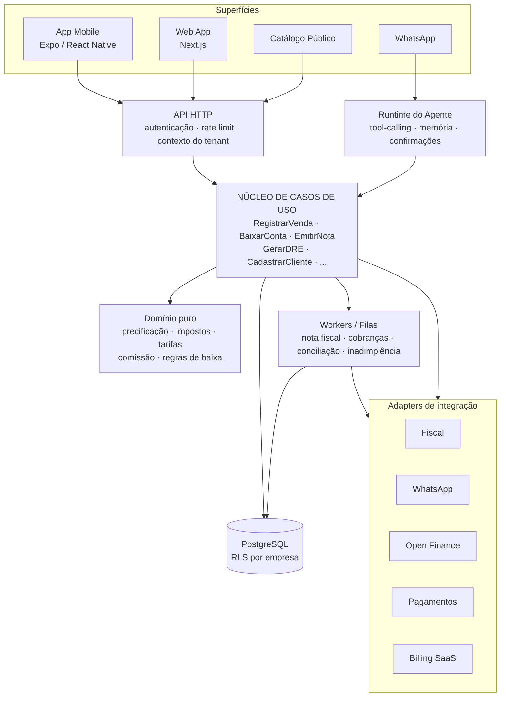
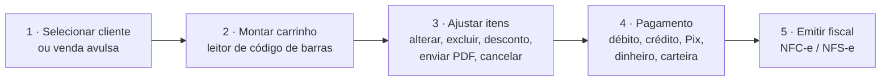
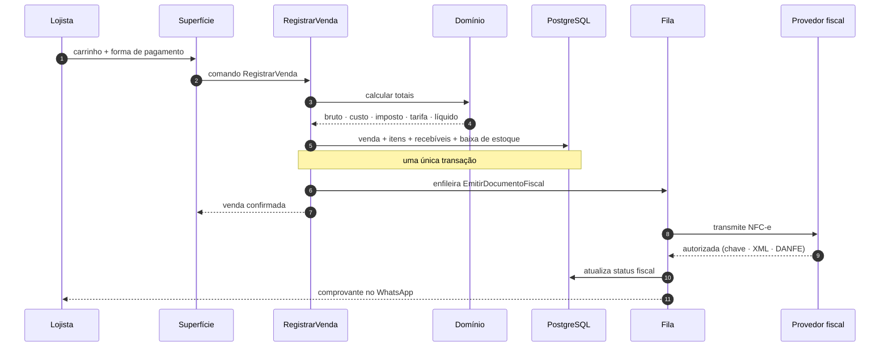
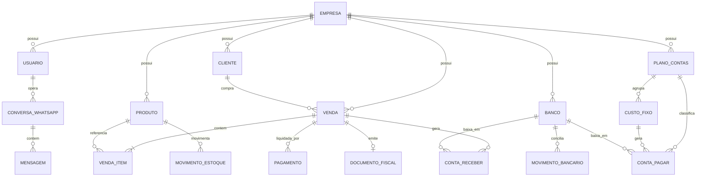
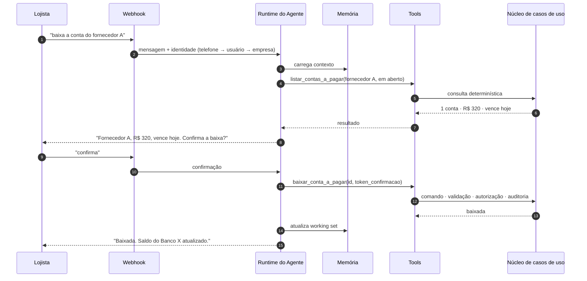
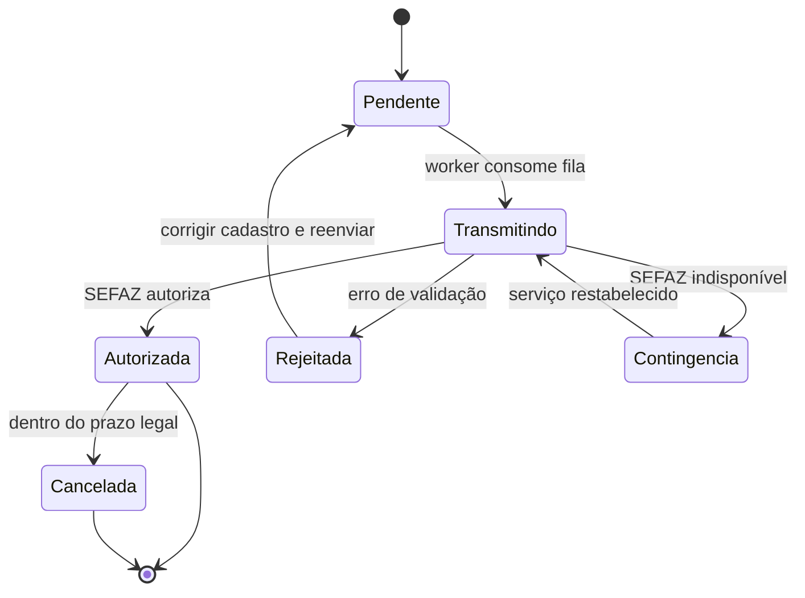
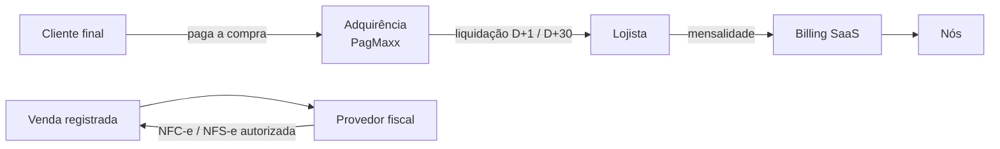
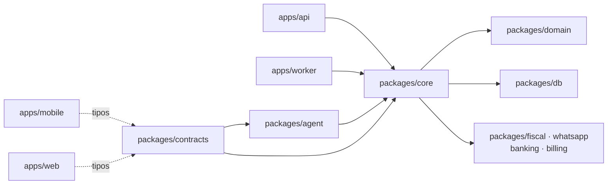
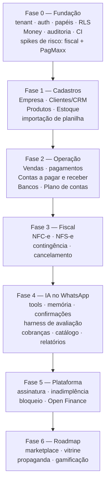

# ZapGestor — Produto, Arquitetura e Stack

> Documento de decisão para discussão em time.
> Base: `ZapGestor_Apresentacao.pdf` (15 slides) + análise técnica.
> Status: **proposta** — nada aqui está fechado.

---

## 1. Sumário executivo

Estamos construindo um **ERP multi-tenant para PMEs brasileiras** com duas superfícies de uso sobre a mesma base: um **aplicativo completo** e um **assistente de IA no WhatsApp** capaz de executar qualquer operação do sistema.

Três coisas definem a dificuldade real deste projeto — e é a partir delas que toda a arquitetura e a escolha de stack se justificam:

| # | Desafio | Consequência |
|---|---------|--------------|
| 1 | **Emissão fiscal (NFC-e/NFS-e)** é o componente de maior risco | Integramos um provedor, não implementamos. Isso remove o argumento histórico de "ERP brasileiro tem que ser .NET/Delphi/PHP" — raciocínio completo na [seção 8.1](#81-o-que-realmente-decide-a-escolha) |
| 2 | **A IA não pode ser uma segunda implementação do ERP** | Núcleo de casos de uso único; o app e o agente chamam os *mesmos* handlers |
| 3 | **As tools da IA e os contratos da API precisam ser o mesmo artefato** | Se forem definições separadas, elas divergem — e a falha é *silenciosa* |

O item 3 é o que mata produtos como este no sexto mês. Está detalhado na [seção 8](#8-stack--análise).

---

## 2. Princípio arquitetural central

> **Uma operação de negócio existe em um único lugar. As superfícies são apenas portas de entrada.**

O erro clássico em produtos "app + bot" é implementar `registrar venda` duas vezes: uma no controller REST, outra no handler do bot. Aí as duas divergem em validação, em autorização, em cálculo de imposto — e ninguém percebe até um lojista emitir nota com valor errado.

Nossa regra: **todo caso de uso é um handler de domínio.** A API REST o expõe como endpoint. O agente de IA o expõe como *tool*. Mesma validação, mesma autorização, mesma auditoria, mesmo cálculo.



**Leitura do diagrama:** existe exatamente um caminho entre qualquer superfície e o banco, e ele passa pelo núcleo. Não há atalho do agente para o SQL.

---

## 3. Requisitos funcionais

### 3.1 Empresa (tenant)

| Campo / função | Origem | Observação |
|---|---|---|
| CNPJ, endereço completo, DDD/celular, IE, IM, ramo de atividade | Slide 6 | — |
| Comissões habilitáveis | Slide 6 | Implica módulo de vendedor/comissão a especificar |
| Busca automática por CEP e por CNPJ | Slide 6 | Integração ReceitaWS/BrasilAPI + ViaCEP |
| **Regime tributário** (Simples / Presumido / Real) | *não mapeado* | **Obrigatório** — determina todo o cálculo de imposto |
| **Certificado digital A1** | *não mapeado* | **Obrigatório** para emissão fiscal |
| **Série e numeração de NF** | *não mapeado* | **Obrigatório** — controle sequencial por série |
| **Usuários e papéis** | *não mapeado* | Lojista com funcionários precisa de perfis e permissões |

### 3.2 Clientes / CRM

- **Campos:** CPF/CNPJ, nome, DDD/celular, endereço completo
- **Funções:** buscar CEP, CPF e CNPJ; importar planilha de clientes
- **Via WhatsApp:** cadastrar cliente · última compra do cliente X · clientes inativos · faturamento mês a mês · ranking de clientes e produtos · gerar DRE · enviar mensagem para cliente X
- **Adicional necessário:** consentimento LGPD e *opt-out* de mensagens ativas

### 3.3 Produtos e catálogo

- **Campos:** código, descrição, imagem, NCM, preço de custo, preço de venda, categoria, fornecedor
- **Funções:** pesquisar por EAN e NCM, importar planilha em lote
- **Via WhatsApp:** produtos sem venda há X tempo · ranking de mais vendidos · mais lucrativos · precisam de reposição · mensagem para quem já comprou o produto · gerar link do catálogo
- **Adicional necessário:** unidade de medida, CFOP, CST/CSOSN, origem — **campos obrigatórios na NFC-e**

### 3.4 Vendas



No momento da venda o sistema calcula automaticamente **custo do produto por item**, **imposto a pagar** e **tarifa do cartão**, e gera o **valor líquido** em contas a receber.



> **Decisão pendente:** venda no crédito parcelado gera **N** contas a receber (uma por parcela, com datas e líquidos distintos), não uma só. Precisamos fechar a regra de antecipação e de tarifa por parcela.

### 3.5 Contas a Pagar

- **Campos:** banco, plano de contas, fornecedor, data de vencimento, valor, descrição
- **Funções:** baixar total ou parcial, estornar
- **Via WhatsApp:** o que há para pagar hoje / até uma data · total resumido por plano de contas · baixar conta

### 3.6 Contas a Receber

- **Campos:** banco, cliente, data de emissão e vencimento, referente a, tipo
- **Funções:** baixar total ou parcial, estornar
- **Via WhatsApp:** o que há a receber + enviar cobrança · o que está vencido + enviar cobrança · ranking de recebimentos · baixar

### 3.7 Bancos

- **Campos:** nome do banco, integração via Open Finance
- **Função:** conciliar saldo automaticamente
- **Via WhatsApp:** qual o saldo atual

### 3.8 Plano de Contas

- Estrutura por nome, com **custos fixos vinculados** (nome, plano de contas, banco, dia de vencimento, valor)
- **Geração automática de contas a pagar** a partir dos custos fixos
- **Via WhatsApp:** ranking de gastos · gastos mês a mês · gasto por plano de contas específico

### 3.9 Agenda

Listada como módulo mapeado no slide 15, **sem nenhum detalhamento no deck**. Precisa de especificação: é agenda de compromissos? de serviços (ligada à NFS-e)? de cobranças?

### 3.10 Fiscal

NFC-e e NFS-e integradas ao fluxo de venda. Requisitos derivados: contingência offline, cancelamento dentro do prazo legal, carta de correção, inutilização de numeração.

### 3.11 Assistente de IA no WhatsApp

Cadastros · lançar e estornar vendas · consultar contas a pagar e receber · enviar cobranças e catálogos · relatórios (ranking, DRE, faturamento mensal) · manter contexto da conversa · aprendizado contínuo com o uso.

### 3.12 Plataforma SaaS

Criação de usuário e cupons · cobrança de mensalidade · aviso automático de inadimplência · bloqueio por falta de pagamento. *(Todos listados como decisões em aberto no slide 14.)*

---

## 4. Requisitos não-funcionais

| Requisito | Definição |
|---|---|
| **Isolamento entre empresas** | `empresa_id` em toda tabela, com **Row-Level Security no PostgreSQL**. Um bug de aplicação não pode vazar dados entre tenants |
| **Dinheiro** | Inteiros em centavos (`BIGINT`). Proibido ponto flutuante em campo monetário — regra de lint, não de convenção |
| **Auditoria** | Toda mutação registra quem, quando, de qual superfície, valores antes/depois. Obrigatório porque a IA escreve no banco |
| **Reversibilidade** | Toda operação de escrita tem estorno correspondente |
| **Idempotência** | Webhooks (fiscal, pagamento, WhatsApp) e retentativas de fila |
| **Disponibilidade da venda** | A venda **não pode parar** se a SEFAZ cair. Contingência é requisito, não otimização |
| **LGPD** | Consentimento para mensagem ativa, opt-out, retenção, direito de exclusão |
| **Observabilidade** | Trace por operação, incluindo o raciocínio e as tool calls do agente |

---

## 5. Lacunas identificadas no mapeamento

Pontos que o deck trata como resolvidos ou não menciona, e que precisam de decisão antes de codificar.

| # | Lacuna | Por que importa |
|---|---|---|
| 1 | **Não existe módulo de Estoque** | "Quais produtos precisam de reposição" e "custo do produto por item" exigem saldo. Sem isso, dois requisitos explícitos do deck são impossíveis |
| 2 | **Campos fiscais do produto ausentes** | CFOP, CST/CSOSN, origem e unidade são obrigatórios na NFC-e. Sem eles a nota é rejeitada |
| 3 | **Regime tributário da empresa ausente** | Simples Nacional e Lucro Presumido calculam imposto de formas diferentes |
| 4 | **Certificado digital não mencionado** | Sem A1 não há emissão. Envolve upload seguro, validade e renovação |
| 5 | **Parcelamento no crédito indefinido** | Muda a modelagem de contas a receber |
| 6 | **Usuários e permissões ausentes** | O deck fala em "login/empresa", mas lojista com funcionário precisa de papéis |
| 7 | **Consentimento LGPD para WhatsApp ativo** | Enviar cobrança e catálogo sem opt-in é risco jurídico e de bloqueio do número |
| 8 | **"Aprendizado contínuo" indefinido** | Ver [seção 7](#7-respostas-às-decisões-em-aberto) — não é fine-tuning |
| 9 | **Agenda sem especificação** | Módulo listado como pronto, sem conteúdo |
| 10 | **Comissões sem detalhamento** | Empresa tem "comissões habilitáveis", mas não há regra definida |
| 11 | **Origem das taxas de cartão não definida** | O deck diz que o sistema "calcula a tarifa do cartão", mas não diz de onde vem a taxa. Precisamos de **tabela de taxas por empresa** (elas variam por lojista e por plano) |
| 12 | **Data do recebível de cartão não definida** | Em venda no cartão, a data de vencimento vem do **prazo de liquidação do adquirente** (D+1, D+30), não do lojista. Sem isso o fluxo de caixa fica errado |

---

## 6. Arquitetura

### 6.1 Multi-tenancy

Um único PostgreSQL, `empresa_id` em toda tabela, isolamento **forçado no banco** via Row-Level Security.

```sql
ALTER TABLE vendas ENABLE ROW LEVEL SECURITY;

CREATE POLICY tenant_isolation ON vendas
  USING (empresa_id = current_setting('app.empresa_id')::uuid);
```

Toda transação abre com `SET LOCAL app.empresa_id = ...`. A resolução do tenant muda por superfície:

- **App/Web:** do JWT
- **WhatsApp:** telefone → usuário → empresa

Por que RLS e não só filtro na aplicação: com RLS, esquecer um `WHERE empresa_id` retorna zero linhas em vez de vazar dados do vizinho. Em multi-tenant financeiro, esse é o tipo de erro que não pode depender de code review.

### 6.2 Modelo de dados (núcleo)



`VENDA_ITEM` carrega o **custo no momento da venda** (snapshot), não uma referência ao custo atual do produto — senão o DRE de meses passados muda sozinho quando o lojista atualiza um preço.

### 6.3 O agente de IA

Quatro decisões de design que sustentam o resto:

**1. Tool-calling sobre o núcleo, não RAG sobre o banco.**
O modelo recebe um conjunto de tools tipadas que chamam os mesmos handlers da API. Leitura é SQL determinístico. **O modelo nunca calcula um número** — ele pede o número e o repassa. RAG fica só para ajuda e documentação.

**2. Toda escrita exige confirmação explícita.**
Nenhuma mutação acontece no primeiro turno. O agente descreve o efeito, pede confirmação, e só então executa.

**3. Memória em três camadas.**
- Janela deslizante dos turnos recentes (texto cru)
- Resumo compactado periodicamente
- *Working set* estruturado: último cliente citado, carrinho em aberto, filtro de relatório vigente

**4. Guardrails.**
Limite de valor por operação, rate limit por empresa, escopo de tools por papel do usuário, e auditoria integral — toda tool call fica registrada com argumentos e resultado.



### 6.4 Emissão fiscal e contingência

Emissão é **sempre assíncrona**. A venda é confirmada para o lojista antes da nota ser autorizada — caso contrário uma instabilidade da SEFAZ trava o caixa da loja.



**O provedor fiscal fica atrás de um adapter** (`packages/fiscal`) com interface própria. Trocar de Focus NFe para PlugNotas não deve tocar o núcleo. Candidatos a avaliar: **Focus NFe**, **PlugNotas (TecnoSpeed)**, **eNotas**, **Nuvem Fiscal**.

### 6.5 Os três papéis do dinheiro

Um erro comum é tratar "pagamento" como uma coisa só. No nosso produto são **três integrações distintas**, com fornecedores distintos, contratos distintos e riscos distintos.

| Papel | Pergunta que responde | Fluxo do dinheiro | Candidatos |
|---|---|---|---|
| **Adquirência** | Como o lojista recebe do cliente final dele? | cliente final → lojista | **PagMaxx**, Stone, Cielo, PagBank, InfinitePay, Mercado Pago |
| **Billing SaaS** | Como nós cobramos a mensalidade do lojista? | lojista → nós | Asaas, Pagar.me, Iugu, Stripe |
| **Fiscal** | Como a venda vira documento fiscal? | não move dinheiro | Focus NFe, PlugNotas, eNotas, Nuvem Fiscal |



**PagMaxx resolve o primeiro papel apenas.** Não emite NFC-e nem NFS-e, e não serve para cobrar nossa assinatura recorrente. São três contratos, não um.

### 6.6 Maquininha integrada vs. não integrada

Essa é a decisão técnica de maior impacto no módulo de vendas, e ela é **independente de qual adquirente escolhermos**.

| | Não integrada (standalone) | Integrada (TEF / SmartPOS) |
|---|---|---|
| Operação | Lojista digita o valor na maquininha **e** registra a venda no ERP | ERP envia o valor à maquininha e recebe a confirmação |
| Risco | Duas fontes de verdade; divergência silenciosa | Fonte única |
| Tarifa do cartão | **Estimada** por tabela configurada | Real, com NSU e autorização |
| Conciliação | Manual ou por Open Finance | Automática por NSU |
| Esforço | Baixo | Alto — depende de SDK do adquirente |

O deck pede que "no momento da venda o sistema calcule a tarifa do cartão e gere o líquido em contas a receber". **Isso funciona nos dois modos** — mas só o integrado dá valor *real* em vez de *estimado*, e só ele permite conciliar o recebido com o esperado sem trabalho manual.

**Proposta:** suportar os dois. Não integrada é o caminho padrão (funciona com qualquer maquininha que o lojista já tenha); integrada é um ganho por adquirente parceiro. O ERP guarda uma **tabela de taxas por empresa** para calcular o líquido estimado, e reconcilia depois contra a liquidação real.

> **Importante para a estratégia comercial:** a maioria dos lojistas **já tem maquininha** de outro adquirente. Se o produto exigir PagMaxx para funcionar, cada venda vira também uma troca de adquirente — que é uma objeção comercial pesada. O adapter tem que permitir "qualquer maquininha, não integrada" como caminho padrão.

### 6.7 Processamento assíncrono

Fila com Redis. Trabalhos:

| Fila | Responsabilidade |
|---|---|
| `fiscal` | Emissão, cancelamento, contingência, consulta de status |
| `whatsapp-out` | Cobranças, catálogos, comprovantes, avisos |
| `open-finance` | Sincronização de extrato e conciliação |
| `financeiro` | Geração de contas a pagar a partir de custos fixos |
| `billing` | Cobrança da mensalidade, aviso de inadimplência, bloqueio |
| `relatorios` | DRE e rankings pesados |

---

## 7. Respostas às "decisões em aberto"

O slide 14 lista nove pontos. Sete têm resposta arquitetural direta.

| Questão do deck | Proposta |
|---|---|
| **Como será a busca de informações (mecanismo por trás da IA)?** | Tool-calling tipado sobre o núcleo de casos de uso. Leitura = SQL determinístico. RAG só para ajuda/documentação |
| **Como manter o contexto da conversa com a IA** | Estado por (empresa, telefone): janela de turnos + resumo compactado + working set estruturado, persistido no PostgreSQL |
| **Como conectar o número de WhatsApp do cliente ao sistema** | **O lojista não conecta número nenhum.** Ele manda mensagem para o *nosso* número e é identificado pelo caller ID. Um número por tenant custa caro e é operacionalmente pesado |
| **Estrutura do banco de dados por login/empresa** | Um PostgreSQL, `empresa_id` em toda tabela, RLS no banco. Schema-por-tenant só se um cliente grande exigir isolamento físico |
| **Como a IA vai aprender/melhorar com o uso** | **Não é fine-tuning.** É: log de toda tool call + falhas de intenção → curadoria semanal → melhora de descrições de tools, exemplos few-shot e prompt. Fine-tuning só faria sentido com volume muito alto e ganho comprovado |
| **Como cobrar a mensalidade / inadimplência / bloqueio** | Provedor de billing recorrente com Pix e boleto (Asaas, Pagar.me, Iugu ou Stripe). Estado da assinatura como campo da empresa; middleware bloqueia escrita mas **mantém leitura e exportação** — bloquear o acesso aos próprios dados gera atrito jurídico |
| **Criação de usuário e cupons** | Onboarding self-service com CNPJ; cupom como entidade própria com regra de desconto e validade |

As duas restantes são decisões de produto, não de arquitetura, e ficam para o time.

---

## 8. Stack — análise

### 8.1 O que realmente decide a escolha

**(a) Fiscal é compra, não construção — e por que isso muda a escolha de linguagem.**

Essa é a afirmação mais contestável do documento, então vale abrir por inteiro.

**O argumento histórico existia, e estava certo.** Não era inércia nem gosto pessoal — era engenharia correta para a época. Emitir uma NFC-e exige:

- **Geração de XML** conforme layout da SEFAZ, validado contra XSD — e o layout **muda continuamente**. A SEFAZ publica Notas Técnicas com prazo de adequação. Não é construir uma vez; é manter para sempre.
- **Assinatura digital** XMLDSig *enveloped*, com canonicalização C14N específica, usando certificado ICP-Brasil. Errar a canonicalização por um espaço em branco invalida a assinatura.
- **Web services SOAP por UF** — cada estado com WSDL, endpoint e comportamento próprios, sobre TLS mútuo com o certificado do cliente.
- **Cálculo tributário** — ICMS com substituição tributária, DIFAL, FCP, PIS/COFINS por regime, IPI, com regras que variam por estado.
- **Contingência** — SVC, EPEC, FS-DA e o modo offline da NFC-e, cada um com regra própria de entrada e de regularização.
- **NFS-e municipal** — os ~5.570 municípios, com variantes ABRASF e layouts próprios.

Construir isso do zero não é um sprint, é um produto inteiro. Por isso, ao longo de 15–20 anos, as comunidades construíram bibliotecas que encapsulam tudo:

| Biblioteca | Linguagem | Posição |
|---|---|---|
| **ACBr** | Delphi / Object Pascal | Padrão de facto no software comercial brasileiro |
| **NFePHP / sped-nfe** | PHP | Implementação open source mais completa fora do Delphi |
| **DFe.NET, Unimake, Zeus** | .NET | Alternativa consolidada |

E aqui está o ponto: **quem escolhesse Node ou Python ficava sozinho**, escrevendo cliente SOAP para SEFAZ e canonicalização XMLDSig na mão. Diante disso, escolher a linguagem onde a biblioteca já existia era a decisão racional. É por isso que tanto ERP brasileiro é Delphi e PHP.

**O que mudou.** Surgiram provedores fiscais como SaaS — Focus NFe, PlugNotas (TecnoSpeed), eNotas, Nuvem Fiscal, WebmaniaBR e outros — que absorveram a carga inteira e expõem **REST + JSON + webhook**. Eles assumem no nosso lugar:

- **Acompanhar as Notas Técnicas** — o custo que todo mundo subestima, porque é recorrente e não inicial
- **Guarda do certificado** — sobe-se o A1, eles custodiam
- **Contingência automática**
- **Cobertura municipal de NFS-e** — a maior razão isolada para comprar. Nenhuma biblioteca cobre 5.570 municípios; os provedores mantêm essa cobertura porque *é* o produto deles

Quando a integração fiscal vira `POST /v2/nfce` com corpo JSON e callback de webhook, a pergunta "qual linguagem tem a boa biblioteca de SEFAZ?" deixa de ser uma pergunta. Qualquer linguagem que faça HTTP e JSON se qualifica — ou seja, todas.

**Onde o argumento histórico continua valendo.** Ele não some; volta em três situações:

1. **Internalizar a emissão por margem.** Provedor cobra por documento; em volume alto vira linha relevante de custo. Nesse cenário PHP e .NET voltam à mesa com força — em TS/Python começaríamos quase do zero. É o gatilho nº 2 da [seção 8.4](#84-o-que-muda-a-recomendação).
2. **Certificado A3** (token/smartcard) exige acesso PKCS#11 nativo, bem mais confortável em .NET/Delphi. Mas A1 é o padrão para SaaS, e se o provedor guarda o certificado isso fica irrelevante.
3. **Obrigações acessórias além da nota** — SPED ECD/ECF, EFD-Contribuições. A cobertura de provedor é menor aí. Se o produto avançar para contabilidade completa, a lacuna reaparece.

**Conclusão: o argumento não desaparece, ele muda de lugar.** Deixa de ser critério de *escolha de linguagem* e vira critério de *escolha de fornecedor*. E é para lá que o risco se mudou:

- Preço por documento e como escala
- **Cobertura municipal nas cidades onde nossos clientes realmente estão** — genérico não serve; checar contra a base-alvo
- Uptime e qualidade do sandbox de homologação
- Tratamento de contingência
- **Onde ficam os XMLs.** A guarda é obrigação legal de 5 anos. Se estão só no provedor, isso é lock-in com peso jurídico — precisamos espelhar em storage nosso

É por isso que o spike fiscal está na Fase 0 e a decisão 7 diz "decidir por spike, não por catálogo".

> *Verificar antes de fechar:* preço atual e cobertura municipal mudam com o tempo. Confirmar direto com cada provedor.

**(b) As tools da IA e os contratos da API precisam ser o mesmo artefato.**

O agente terá 40–60 tools. Cada uma é um JSON Schema entregue ao modelo. A API tem schemas de validação para as mesmas operações.

Se forem definições separadas, **elas divergem — e a falha é silenciosa.** Renomeamos um campo na API, o schema da tool continua anunciando o antigo, o modelo chama com o campo velho, e o lojista registra uma venda errada. Nenhum compilador pega isso. Descobrimos por ticket de suporte.

A pergunta para cada stack é: *dá para derivar o schema da tool do schema de validação?*

| Stack | Deriva? | Como |
|---|---|---|
| TypeScript | **Sim, sem geração** | zod → `zod-to-json-schema`; o mesmo objeto valida o HTTP e define a tool |
| Python | **Sim, sem geração** | pydantic emite JSON Schema nativamente |
| Go / Java / C# | **Não** | Schemas escritos à mão ou máquina de reflection |

**(c) O leitor de código de barras obriga app nativo.**
O slide 4 pede leitor no catálogo. Isso é Expo/React Native. **Ou seja: escreveremos TypeScript de qualquer forma.** A única pergunta é se escreveremos uma segunda linguagem também.

### 8.2 Comparação

| | Node + TS | Python | Go | .NET | PHP/Laravel |
|---|---|---|---|---|---|
| Deriva tool schema | ✅ nativo | ✅ nativo | ❌ | ❌ | ❌ |
| Linguagem única com mobile | ✅ | ❌ | ❌ | ❌ | ❌ |
| Decimal nativo | ❌ *(centavos + lint)* | ✅ | ✅ | ✅ | ⚠️ |
| SDK de IA maduro | ✅ | ✅ | ⚠️ | ⚠️ | ❌ |
| Fiscal in-house depois | ❌ | ❌ | ❌ | ✅ ACBr | ✅ NFePHP |
| Velocidade em CRUD | ✅ | ✅ | ❌ | ✅ | ✅ |
| Fila madura | BullMQ | Celery/ARQ | asynq | ✅ Hangfire | ✅ Horizon |
| Talento no Brasil | ✅ amplo | ✅ amplo | ⚠️ escasso | ⚠️ caro | ✅ amplo |
| Backoffice pronto | ❌ | ❌ | ❌ | ⚠️ | ✅ **Filament** |

**Notas por opção:**

- **Node + TS** — o ganho não é "mesma linguagem" como vibe, são mecanismos concretos: um schema zod é simultaneamente validador HTTP, tipo inferido e tool do modelo; o mobile compartilha tipos e lógica pura. Custo real: sem decimal nativo, disciplina de centavos vira obrigação. Sobre framework: **NestJS provavelmente é exagero** para time pequeno — DI, decorators e módulos rendem a partir de ~5 devs; abaixo disso é cerimônia. Fastify com camadas simples é melhor. Sobre ORM: **Drizzle, não Prisma** — raciocínio completo na [seção 8.5](#85-orm-por-que-drizzle-e-não-prisma).

- **Python** — mais competitivo do que parece. pydantic resolve o problema das tools tão bem quanto zod, `Decimal` é nativo (o risco de dinheiro simplesmente some), e SQLAlchemy 2.0 lida bem com RLS e agregados financeiros. Custo preciso: duas linguagens, contrato gerado via OpenAPI → `openapi-typescript`. Funciona bem; o que se perde de fato é lógica compartilhada com o mobile.

- **Go** — recomendo contra *neste produto*. Ótimo para ingestão de webhook e `sqlc` é excelente para query financeira tipada. Mas são nove módulos CRUD, e Go torna CRUD verboso. Pior: não há caminho limpo para derivar schema de tool.

- **.NET** — tecnicamente excelente: EF Core, Hangfire (a melhor fila desta lista), decimal nativo, ACBr se internalizarmos fiscal. Contra: duas linguagens, sem derivação de tools, e os SDKs de IA em .NET são cidadãos de segunda classe em streaming e loop de tool-use.

- **PHP/Laravel** — omiti antes e foi um erro. Para "SaaS B2B brasileiro, time pequeno, entregar rápido" é quase território natural do Laravel: NFePHP se quisermos emissão própria, Cashier para assinatura, Horizon para filas e **Filament entregando o backoffice interno praticamente de graça** — semanas de trabalho que não fazemos. Contra: pior ecossistema de IA da lista e duas linguagens com o mobile.

### 8.3 Recomendação

**Node + TypeScript · Fastify · Drizzle · PostgreSQL · BullMQ/Redis · Expo · Next.js**

Por ordem de peso:

1. **A divergência entre tools e contratos é o principal risco de correção de longo prazo**, e TypeScript o elimina sem etapa de geração. Python empata; o resto não chega perto.
2. **Escreveremos TS para o mobile de qualquer jeito.** Para time pequeno, uma linguagem em api/web/mobile compõe: um toolchain, um CI, um modelo mental.
3. **Fiscal como provedor REST removeu a razão histórica** de escolher .NET ou PHP.

**Custo que estamos aceitando conscientemente:** ausência de decimal nativo em software financeiro. Mitigação obrigatória — inteiros em centavos em toda camada, tipo `Money`, e regra de lint proibindo aritmética de ponto flutuante em campo monetário.

### 8.4 O que muda a recomendação

Em ordem de força:

1. **"O time é forte em Python/C#/PHP e fraco em TS."** Então escolhemos o que dominamos, sem debate. Para time pequeno, velocidade de execução ganha de qualquer argumento arquitetural acima — e não é perto.
2. **"Queremos internalizar fiscal em 18 meses por margem."** PHP ou .NET ficam sérios.
3. **"Analytics e previsão são centrais, não decorativos."** O caso do Python cresce muito.

---

### 8.5 ORM: por que Drizzle e não Prisma

Prisma é o padrão de mercado e tem DX melhor em várias frentes. A recomendação aqui é contra a corrente, então precisa de justificativa.

**Argumento 1 — RLS deixa de ser opcional por construção.** Este é o principal.

Nossa política de isolamento lê uma variável de sessão:

```sql
CREATE POLICY tenant_isolation ON vendas
  USING (empresa_id = current_setting('app.empresa_id')::uuid);
```

Para funcionar, **toda** query precisa rodar numa conexão onde `app.empresa_id` foi definida — e com `SET LOCAL` dentro de uma transação, senão o valor vaza para a próxima request via pool de conexões.

- **Prisma** administra o próprio pool e não expõe a conexão. O caminho é envolver tudo em `$transaction` + `$executeRaw` com `SET LOCAL`, ou construir uma Client Extension que injete isso. Funciona — mas **a extension vira a única coisa entre nós e um vazamento entre tenants**, e é fácil de contornar sem querer (um `prisma.venda.findMany()` direto passa reto).
- **Drizzle** é uma camada fina sobre o driver que nós controlamos. Isso permite algo que o Prisma não permite: **tornar impossível obter um handle de banco sem contexto de tenant.**

```ts
// packages/db — o ÚNICO jeito de acessar dados
export async function withTenant<T>(
  empresaId: string,
  fn: (tx: TenantDb) => Promise<T>,
): Promise<T> {
  return pool.transaction(async (tx) => {
    await tx.execute(sql`SET LOCAL app.empresa_id = ${empresaId}`);
    return fn(tx as TenantDb);
  });
}
```

Não exportamos o `db` cru. Quem quiser dados **tem** que passar por `withTenant`. Isso é uma garantia estrutural, não uma convenção de code review — e em multi-tenant financeiro essa diferença é a que importa.

**Argumento 2 — os relatórios são a metade do produto.**

DRE, ranking de clientes, faturamento mês a mês, "produtos sem venda há X tempo", "clientes que não compram há muito tempo" são queries analíticas: múltiplos joins, `GROUP BY`, funções de janela, séries com `date_trunc`, CTEs, `LATERAL`.

A API do Prisma não expressa isso. Na prática caímos em `$queryRaw` — ou seja, **perdemos tipagem exatamente onde ela é mais valiosa**, e passamos a manter dois modelos mentais (API do Prisma para CRUD, SQL cru para relatório). Drizzle é SQL tipado: o mesmo modelo mental serve para os dois, e o que escrevemos é o que roda.

Isso pesa mais aqui do que num CRUD comum porque o deck lista DRE e rankings como **comandos de WhatsApp** — são feature de primeira classe, não relatório de canto.

**Argumento 3 — controle de conexão.** Sem query engine separado; funciona previsivelmente com PgBouncer em modo transaction, e o `EXPLAIN` reflete o que escrevemos.

**Onde o Prisma ganha, honestamente:**

| | Prisma | Drizzle |
|---|---|---|
| Ferramenta de migration | ✅ mais madura (shadow DB, diffing) | Drizzle Kit é bom, historicamente mais rústico |
| GUI | ✅ Prisma Studio | — |
| Legibilidade do schema | ✅ DSL própria | TS puro, mais verboso |
| Comunidade e exemplos | ✅ muito maior | Menor |
| Familiaridade para contratar | ✅ | Menos comum |

**A contra-posição legítima:** se decidirmos **não usar RLS** e fazer o isolamento só na aplicação (repository que sempre injeta `empresa_id`), a fraqueza do Prisma desaparece e ele vira escolha razoável. Eu argumento contra essa arquitetura — defesa em profundidade no banco vale o atrito — mas é uma decisão de time, não um fato técnico.

> **Terceira opção:** **Kysely** — query builder puro, tipagem excelente, sem DSL de schema. Bom meio-termo se alguém achar Drizzle imaturo demais.

### 8.6 Camada de IA e portabilidade de modelo

**Requisito definido pelo time:** o agente usa **um modelo por vez**. Não queremos rotear por tarefa nem operar multi-provider em runtime — queremos **poder trocar** se decidirmos trocar. O motivo é evitar lock-in, não custo nem failover.

Essa distinção é o que torna a portabilidade barata, e vale deixar explícita:

| Nível | O que é | Onde se paga |
|---|---|---|
| **Portabilidade opcional** ← o nosso caso | Trocar de modelo é um projeto de dias | Só na hora da troca |
| **Multi-provider em runtime** | Rotear por tarefa ou tenant, failover automático | Gateway, salto de latência, custo **contínuo** |

Três consequências diretas:

- **Vercel AI SDK sim** — é a abstração padrão em TypeScript que dá tool-calling uniforme com Zod entre providers, com troca por configuração. Fina, MIT, pouco lock-in.
- **Gateway não** (LiteLLM, Portkey, OpenRouter) — gateway resolve roteamento e failover em runtime, que não é o nosso caso. Reavaliar **apenas** se o motivo mudar para disponibilidade.
- **Otimização específica de provider é permitida** — ver abaixo, é o que evita pagar imposto de portabilidade todo mês.

#### O que já é agnóstico — que é quase tudo

Não é acidente: o desenho da [seção 6.3](#63-o-agente-de-ia) coloca correção e segurança na **nossa** camada, não no comportamento do modelo.

| Componente | Depende do provider? |
|---|---|
| Tools = nossos handlers de caso de uso | ❌ |
| Schemas Zod → JSON Schema | ❌ todo provider consome JSON Schema |
| Leitura determinística (o modelo nunca calcula número) | ❌ |
| Gate de confirmação em dois turnos | ❌ código nosso |
| Memória em três camadas no PostgreSQL | ❌ código nosso |
| Auditoria de toda tool call | ❌ código nosso |
| Formato da chamada, streaming, controles de reasoning | ✅ — é o que o AI SDK abstrai |
| **Cache de prompt** | ✅ — e é o caro |

#### Onde a portabilidade custaria, e por que aqui custa pouco

**Cache de prompt.** Cada provider implementa de um jeito. Nosso prefixo — prompt de sistema + 40–60 definições de tool — aparece em **toda** mensagem de **todo** lojista, então é a maior alavanca de custo do produto.

Numa arquitetura multi-provider em runtime, o cache vira mínimo denominador comum e a conta sobe todo mês. **No nosso caso não.** Como roda um modelo por vez, otimizamos o cache para o provider vigente, com código específico isolado, e aceitamos que trocar significa retunar isso. **É dívida de troca, não imposto contínuo.**

Independente de provider, uma regra vale sempre: o cache é por prefixo exato, e **a lista de tools precisa ser serializada em ordem determinística**. Um `Object.keys()` sem ordenação, ou uma tool registrada condicionalmente, invalida o cache silenciosamente e multiplica a conta.

**Segunda fonte de custo:** a confiabilidade de tool-calling com 40–60 tools varia bastante entre modelos — alguns degradam com superfície grande. Pode ser necessária estratégia diferente de superfície por modelo. É mais um item que aparece na troca, e mais uma razão para o harness abaixo.

#### A regra que mantém a porta aberta

Uma só: **nada específico de provider sai de `packages/agent`.** O núcleo de casos de uso não sabe qual modelo está rodando. É a mesma regra já aplicada ao fiscal, ao WhatsApp e ao adquirente.

```
packages/agent
├── provider/        # Vercel AI SDK + configuração do provider vigente
│   └── cache.ts     # otimização específica — a dívida de troca mora aqui, documentada
├── tools/           # derivadas dos schemas Zod de packages/contracts
├── memory/          # janela + resumo + working set
├── confirm/         # gate de confirmação de escrita
└── index.ts         # a interface que o resto do sistema enxerga
```

#### Harness de avaliação — o que torna a troca real

"Podemos trocar de modelo" só é verdade se dá para **provar** que a troca não degradou nada. Para um agente que registra venda e baixa conta a pagar, trocar no escuro é perigoso.

- Conjunto de ~100–200 mensagens reais de lojista em português → tool call esperada (nome + argumentos)
- Métricas: tool correta, argumentos corretos, taxa de número alucinado, respeito ao gate de confirmação
- Roda contra qualquer modelo candidato; mudança de modelo fica *gated* por isso no CI

Barato de construir junto com o agente, caro de retrofitar. **Sem ele, "model-agnostic" é aspiração e não propriedade** — porque na hora de trocar ninguém vai ter coragem sem evidência, e a portabilidade que compramos não vai ser usada.

#### O que não usar: framework de orquestração

**LangChain / LangGraph — não.** Três razões:

1. **O agente já está especificado concretamente.** Tools são nossos handlers, a memória é o desenho de três camadas, o fluxo é um laço com tabela de dispatch. As abstrações de memória do LangChain não batem com o nosso desenho — brigaríamos com o framework.
2. **O valor principal dele é o que não usamos** — componentes trocáveis e integrações prontas de RAG, vector store e document loader. Fazemos tool-calling sobre a nossa própria API.
3. **Indireção aqui tem custo de segurança.** O agente escreve em registro financeiro. Ver e raciocinar sobre o prompt exato e o payload exato de cada tool é propriedade de segurança, não preferência estética.

Se os fluxos de confirmação ficarem complexos, modelamos a máquina de estados nós mesmos — é menos código que a configuração equivalente num framework.

---

## 9. Avaliação: PagMaxx (adquirência)

### 9.1 O que apuramos

**O que é.** Processadora / sub-adquirente brasileira. Maquininhas (Mini 3, Pro, Smart), aceitação de Visa, Mastercard, Elo, Hipercard, Amex e cartões de benefício, Pix por QR Code, aproximação NFC e comprovante por SMS.

**Taxas divulgadas no site** *(verificar — muda com o tempo e provavelmente é negociável)*:

| Plano | Débito | Crédito | Parcelado | Mensalidade |
|---|---|---|---|---|
| Club Fluxo Normal | 0,89% | 1,29% | 1,99–2,39% | R$ 19,90–49,90 |
| Free Fluxo Normal | 1,25% | 2,50% | 3,00–3,60% | conforme plano |

**Split de pagamentos:** o site informa "disponível apenas para integração via API". Ou seja, **existe API**.

**Registro societário provável:** Pagmax Administradora de Meios de Pagamentos e Serviços Ltda · CNPJ 16.725.465/0001-40 · Santana de Parnaíba/SP · aberta em 2012 · CNAE 6613-4/00 (administração de cartões de crédito).

> ⚠️ **A grafia difere** — o site é "Pagmaxx", o registro encontrado é "Pagmax". Podem ser a mesma empresa com variação de marca, ou não. **Confirmar a entidade** antes de assinar qualquer contrato.

### 9.2 O achado que importa

**Não encontramos documentação pública de API.** Sem portal de desenvolvedor, sem sandbox aberto, sem SDK, sem presença em buscas técnicas.

Isso **não significa que não exista API** — a própria página de split diz que existe. Significa duas coisas:

1. **Não conseguimos avaliá-la antes de conversar com eles.** Toda estimativa de esforço de integração é chute até termos a documentação em mãos.
2. **A experiência de desenvolvedor provavelmente é menos madura** que a de players com portal aberto (Stone, PagBank, Mercado Pago, Asaas). Isso é risco de cronograma, não impedimento.

### 9.3 Perguntas para o spike com a PagMaxx

**Técnicas**

| # | Pergunta | Por que importa |
|---|---|---|
| 1 | Existe documentação de API e sandbox de homologação? | Define se conseguimos desenvolver sem depender de suporte humano |
| 2 | Há webhooks de transação e de liquidação? | Sem webhook, viramos polling — pior e mais caro |
| 3 | A maquininha é integrável (TEF ou SDK de SmartPOS) ou só standalone? | Define se o valor da tarifa é real ou estimado — ver [seção 6.6](#66-maquininha-integrada-vs-não-integrada) |
| 4 | As SmartPOS são Android abertas? Dá para publicar nosso app nelas? | Resolveria PDV + leitor de código de barras num aparelho só |
| 5 | Existe API ou arquivo de conciliação (EDI)? | Necessário para bater recebido contra esperado |
| 6 | As taxas variam por lojista? | O ERP precisa de tabela de taxas **por empresa** para calcular o líquido correto |
| 7 | Prazos de liquidação (D+1 / D+30) e regras de antecipação? | Determinam a data do recebível gerado na venda |

**Comerciais e estratégicas**

| # | Pergunta | Por que importa |
|---|---|---|
| 8 | Quais as regras do split? Podemos usá-lo para monetizar? | Abre receita por transação, além da mensalidade |
| 9 | Existe API de onboarding — o lojista vira cliente PagMaxx de dentro do nosso app? | **A pergunta mais valiosa da lista** se houver parceria |
| 10 | É parceria comercial ou apenas fornecedor? | Ver abaixo |

### 9.4 A pergunta de fundo

**PagMaxx é escolha técnica ou decisão comercial?** As duas são legítimas, mas levam a arquiteturas e prioridades diferentes:

- **Se é fornecedor técnico** — escolhemos por qualidade de API e o adapter mantém a porta aberta. Nesse caso, com a ausência de documentação pública, é justo comparar contra alternativas com portal maduro antes de fechar.
- **Se é parceria comercial** — distribuir o ERP pela base de lojistas da PagMaxx e/ou receber parte da receita de pagamento — então é decisão de negócio, e a arquitetura só precisa não nos prender. Esse modelo ("SaaS + pagamentos") é comprovado e frequentemente rende mais que a mensalidade do software. Se for esse o plano, **a pergunta 9 acima é a mais importante de todas**.

### 9.5 Recomendação técnica

Vale para qualquer um dos cenários acima:

1. **PagMaxx atrás de `packages/payments`**, como primeira implementação de uma interface — nunca acoplada ao núcleo.
2. **"Maquininha não integrada" como caminho padrão.** A maioria dos lojistas já tem adquirente. Exigir a troca para usar o produto é objeção comercial pesada.
3. **Tabela de taxas por empresa** desde o início, mesmo sem integração — é o que permite calcular o líquido estimado.
4. **Plano B para escala:** existe middleware de TEF (ex.: Connect TEF) que conecta PDV/ERP a várias SmartPOS e adquirentes com uma integração só. Vale avaliar se um dia precisarmos suportar muitos adquirentes sem integrar um a um.

---

## 10. Estrutura do repositório

Monorepo com pnpm workspaces + Turborepo.

```
na-regua/
├── apps/
│   ├── api/                 # Fastify — REST + webhooks + runtime do agente
│   ├── worker/              # BullMQ — filas e jobs agendados
│   ├── mobile/              # Expo — app do lojista (leitor de código de barras)
│   └── web/                 # Next.js — backoffice, catálogo público, landing
│
├── packages/
│   ├── core/                # ★ NÚCLEO — casos de uso (handlers)
│   ├── domain/              # regras puras: precificação, impostos, tarifas, comissão
│   ├── contracts/           # schemas zod — validação HTTP + tipos + tools da IA
│   ├── db/                  # schema Drizzle, migrations, políticas RLS
│   ├── agent/               # runtime do agente: tools, memória, confirmações
│   ├── fiscal/              # adapter NFC-e/NFS-e (provedor plugável)
│   ├── whatsapp/            # adapter do provedor de WhatsApp
│   ├── banking/             # adapter Open Finance
│   ├── billing/             # adapter de assinatura SaaS
│   ├── money/               # tipo Money — centavos, sem float
│   └── ui/                  # tokens e componentes compartilhados
│
├── docs/
│   ├── PRODUTO-E-ARQUITETURA.md
│   └── ZapGestor_Apresentacao.pdf
│
├── scripts/
│   └── pdf_to_md.py
│
└── infra/                   # IaC, docker-compose, migrations de deploy
```

**A regra que sustenta a estrutura:** `packages/agent` depende de `packages/core`. Nunca o contrário, e nunca `agent` toca `db` diretamente.



---

## 11. Faseamento proposto



**Duas observações sobre a ordem:**

1. **Os spikes de fiscal e de adquirência precisam acontecer na Fase 0**, não nas fases 3 e 2. É o componente de maior risco e maior incerteza de custo. Queremos uma NFC-e de homologação autorizada por um provedor — e a documentação de API da PagMaxx em mãos — antes de decidir qualquer outra coisa.
2. **A IA vem depois da operação, e isso é proposital.** O agente é barato de construir *quando o núcleo de casos de uso existe* — ele só expõe handlers prontos. Construir o agente antes significa construir o ERP duas vezes.

> **Alternativa a debater:** se a prioridade for validar a tese comercial rápido, dá para inverter Fases 3 e 4 — vender o assistente de IA sem nota fiscal, e adicionar fiscal quando houver cliente pagante. Reduz muito o tempo até a primeira receita, ao custo de um produto incompleto.

---

## 12. Decisões para o time

### Produto

| # | Decisão | Opções |
|---|---|---|
| 1 | **Nome do produto** | ZapGestor · ContaZap · Fechou.AI · Zaply Gestão — *o repositório já se chama `na-regua`, que também funciona como marca* |
| 2 | **Escopo da v1** | MVP de validação · produto vendável |
| 3 | **Superfícies na v1** | Mobile · Web · só WhatsApp · catálogo público |
| 4 | **Inverter fiscal e IA?** | Ver seção 11 |
| 5 | **Especificar Agenda e Comissões** | — |

### Técnicas

| # | Decisão | Opções | Recomendação |
|---|---|---|---|
| 6 | **Stack de backend** | TS · Python · Go · .NET · PHP | **TS** — a menos que o time seja forte em outra |
| 7 | **Provedor fiscal** | Focus NFe · PlugNotas · eNotas · Nuvem Fiscal | Decidir por spike, não por catálogo |
| 8 | **Provedor de WhatsApp** | Meta Cloud API oficial · Evolution/Baileys | **Oficial** — ver abaixo |
| 9 | **Adquirência (venda do lojista)** | **PagMaxx** · Stone · Cielo · PagBank · InfinitePay | Ver [seção 9](#9-avaliação-pagmaxx-adquirência) — e suportar "não integrada" de qualquer forma |
| 10 | **Maquininha integrada?** | Standalone · TEF/SmartPOS · ambos | **Ambos**, começando por standalone |
| 11 | **Billing da nossa assinatura** | Asaas · Pagar.me · Iugu · Stripe | Precisa de Pix e boleto recorrentes. **Não confundir com a decisão 9** |
| 12 | **Open Finance** | Pluggy · Belvo · direto | Agregador |
| 13 | **ORM** | Drizzle · Prisma · Kysely | **Drizzle** — ver [8.5](#85-orm-por-que-drizzle-e-não-prisma). Se abrirmos mão de RLS, Prisma volta |
| 14 | **SDK do modelo** | Vercel AI SDK · SDK de um provider · adapter próprio | **Vercel AI SDK** — ver [8.6](#86-camada-de-ia-e-portabilidade-de-modelo) |
| 15 | **Framework de agente** | Nenhum · LangChain/LangGraph · Mastra | **Nenhum** |
| 16 | **Gateway de IA** | Não · LiteLLM · Portkey · OpenRouter | **Não** — só se o motivo mudar de lock-in para failover |
| 17 | **Modelo inicial** | a definir pelo harness de avaliação | Decidir por evidência, não por preferência |
| 18 | **Monorepo?** | Sim · repos separados | **Monorepo** |

**Sobre o item 8**, porque é o mais controverso:

- **Meta Cloud API (oficial)** — estável, sem risco de banimento, botões interativos (essenciais para o fluxo de confirmação de escrita da seção 6.3). Custo por mensagem e templates precisam de aprovação para mensagens ativas — exatamente o caso de cobrança e catálogo.
- **Evolution API / Baileys (não oficial)** — sem custo por mensagem e sem aprovação de template, mas com **risco real de bloqueio de número**. E o número bloqueado não é nosso: é o canal pelo qual o lojista opera o negócio dele. Um bloqueio derruba o produto do cliente.

Recomendação: **oficial desde o início**, com o provedor atrás do adapter `packages/whatsapp` para manter a porta aberta.

---

## Anexo — Como este documento foi gerado

O deck foi convertido para markdown com `scripts/pdf_to_md.py`:

```bash
python scripts/pdf_to_md.py docs/ZapGestor_Apresentacao.pdf \
  -o docs/ZapGestor_Apresentacao.md \
  --images docs/slides
```

O script reconstrói hierarquia de títulos a partir da proporção de tamanho de fonte e detecta colunas por análise de espaçamento, para que cards lado a lado não se misturem na extração. Requer PyMuPDF (`pip install pymupdf`).
