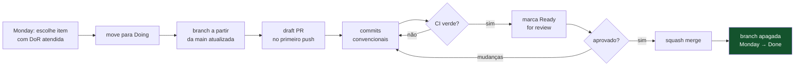

# Fluxo de trabalho

O ciclo diário de uma tarefa, do board ao merge. Como as três trilhas se
coordenam sem pisar uma na outra.

---

## As três trilhas

A divisão é **por camada**, não por funcionalidade. Assim cada pessoa acumula
contexto profundo numa parte do sistema e os PRs raramente conflitam.

| Trilha                              | Foco                                 | Módulos                                                                              |
| ----------------------------------- | ------------------------------------ | ------------------------------------------------------------------------------------ |
| 🔵 **1 — Núcleo & Dados**           | regras de negócio e persistência     | `money` `domain` `contracts` `db` `core`                                             |
| 🟠 **2 — Plataforma & Integrações** | entrada, saída e provedores externos | `api` `worker` `agent` `whatsapp` `fiscal` `banking` `billing` `payments` `infra` CI |
| 🟢 **3 — Clientes**                 | o que o usuário vê                   | `mobile` `web` `ui`                                                                  |

**A trilha 1 é o gargalo no início** — `money` e `contracts` precisam existir
antes das outras duas avançarem. Por isso essas duas tarefas vêm primeiro e são
pequenas de propósito. Ver [Task Ledger](../processo/task-ledger.md).

A divisão é de **responsabilidade, não de propriedade**: qualquer pessoa pode
mexer em qualquer módulo. O dono da trilha revisa.

## O ciclo



### Passo a passo

```bash
# 1. sempre da main atualizada
git switch main && git pull --rebase

# 2. branch com o ID da tarefa
git switch -c feat/NR-042-carrinho-codigo-barras

# 3. draft PR já no primeiro push — visibilidade
git push -u origin HEAD && gh pr create --draft

# 4. antes de pedir revisão, rode o que a CI vai rodar
pnpm typecheck && pnpm test && pnpm boundaries && pnpm format:check
```

O passo 4 economiza a viagem de ida e volta: descobrir em 30 segundos na sua
máquina é melhor que em 3 minutos na CI.

## Definition of Ready

Uma tarefa só pode ser **pega** se:

- [ ] Tem `US-xxx` ou `RF-xxx` vinculado
- [ ] Tem critério de aceite, com pelo menos um caminho de erro
- [ ] Não tem `DEC-xxx` bloqueante em aberto — ou o escopo dela é justamente a parte que não depende da decisão
- [ ] As dependências (`NR-xxx`) estão concluídas
- [ ] Cabe em ≤ 2 dias

Não atende? Ela volta para refinamento. Começar tarefa mal definida é a forma
mais cara de descobrir que ela estava mal definida.

## Definition of Done

Uma tarefa só vai para `Done` se:

- [ ] CI verde: typecheck, lint, testes, fronteiras, formatação
- [ ] PR aprovado e mergeado com squash
- [ ] Testes na camada certa ([`testes.md`](testes.md))
- [ ] README do módulo atualizado, se o comportamento mudou
- [ ] Variável de ambiente nova documentada em [`ambientes.md`](ambientes.md) **e** no `.env.example`
- [ ] Decisão de arquitetura tomada virou ADR ou `DEC`
- [ ] Nenhum `TODO` novo sem tarefa correspondente

## Code review

### Para quem revisa

Revise nesta ordem — de cima para baixo, parando quando achar algo grave:

1. **Está no módulo certo?** Regra de negócio em `apps/*` é o erro mais caro e o mais fácil de deixar passar.
2. **A fronteira foi respeitada?** A CI pega import proibido; ela não pega lógica que _deveria_ estar em `core` e ficou no handler.
3. **O caso de erro foi tratado?** Caminho feliz é a parte fácil.
4. **Dinheiro é `Money`?** `number` com decimal em valor monetário é bug garantido.
5. **Os testes provam algo?** Teste que só verifica que a função foi chamada não prova nada.
6. **Estilo** — por último, e só o que o Prettier não pega.

### Regras de convivência

| Regra                                                | Motivo                                          |
| ---------------------------------------------------- | ----------------------------------------------- |
| Revisão em até **4 horas úteis**                     | PR parado bloqueia a pessoa e envelhece         |
| Comentário diz **por quê**, e propõe alternativa     | "isso está ruim" não é revisão                  |
| Distinga bloqueante de sugestão                      | prefixe com `nit:` o que não bloqueia           |
| Aprovou? mergeie ou libere para mergear              | aprovação sem merge é PR parado com etapa extra |
| Discussão que passa de 3 idas e voltas vira conversa | texto é péssimo para desempate                  |

### Quem revisa o quê

`CODEOWNERS` atribui automaticamente por trilha. Mas:

> **Mudança em `packages/contracts` exige revisão das três trilhas.**

Não é burocracia: `contracts` é a fronteira que todas consomem, e um breaking
change ali quebra as outras duas em silêncio.

## Ligação com o Monday

| Evento no Git              | Efeito no board                   |
| -------------------------- | --------------------------------- |
| Branch criada com `NR-042` | item movido para `Doing` (manual) |
| PR aberto                  | link do PR colado no item         |
| PR mergeado                | item movido para `Done`           |

O `NR-xxx` aparece em quatro lugares — item do Monday, nome da branch, título do
PR e rodapé do commit. É de propósito: qualquer um deles leva aos outros três.

O [Task Ledger](../processo/task-ledger.md) é a **fonte da verdade versionada**;
o Monday é a visualização. Divergiu? o ledger ganha.

## Ritmo

| Ritual                  | Quando           | Duração | Para quê                                              |
| ----------------------- | ---------------- | ------- | ----------------------------------------------------- |
| Sincronia diária        | manhã            | 10 min  | o que travou, não o que fiz                           |
| Refinamento             | meio da semana   | 45 min  | trazer tarefas para o estado _Ready_                  |
| Planejamento            | início da sprint | 1 h     | o que entra, quem pega                                |
| Revisão + retrô         | fim da sprint    | 1 h     | o que entregamos, o que muda no processo              |
| **Revisão de decisões** | semanal          | 15 min  | varrer as [decisões em aberto](../decisoes/README.md) |

A revisão de decisões é o ritual mais fácil de pular e o mais caro de pular:
`DEC` sem prazo vira decisão tomada por omissão dentro de um PR.

Detalhes em [`rituais.md`](../processo/rituais.md).

## Quando você trava

Em ordem:

1. **A resposta está na documentação?** [Índice](../README.md)
2. **É decisão em aberto?** [Decisões](../decisoes/README.md) — se sim, ou você trabalha na parte que não depende dela, ou escala a decisão
3. **É dúvida de fronteira?** [Princípios](../arquitetura/principios.md) e `pnpm boundaries`
4. **Travou mais de 2 horas?** Chame alguém. Duas horas travado sozinho é o limite — depois disso é orgulho, não trabalho.

## Documentos relacionados

- [Git workflow](git-workflow.md) — branches, commits, PR
- [Task Ledger](../processo/task-ledger.md) — o backlog das três trilhas
- [Rituais](../processo/rituais.md) — cerimônias em detalhe
- [Testes](testes.md) — o que testar em cada camada
