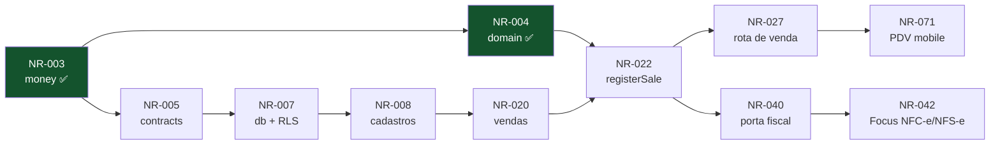

# Task Ledger

Backlog completo dividido em três trilhas. **Fonte da verdade versionada** — o
Monday é a visualização; divergiu, o ledger ganha.

Importação: [`monday-import.csv`](monday-import.csv).

---

## Como ler

| Coluna     | Significado                                                                               |
| ---------- | ----------------------------------------------------------------------------------------- |
| **ID**     | `NR-xxx`, permanente. Aparece na branch, no título do PR, no rodapé do commit e no Monday |
| **Trilha** | 🔵 1 Núcleo & Dados · 🟠 2 Plataforma & Integrações · 🟢 3 Clientes                       |
| **Est**    | estimativa em dias. **Acima de 2 dias, a tarefa deve ser quebrada**                       |
| **Dep**    | tarefas que precisam estar concluídas antes                                               |
| **Bloq**   | decisão em aberto que impede _terminar_ — nem sempre impede _começar_                     |
| **Status** | ⬜ a fazer · 🟨 em andamento · ✅ concluída · 🚧 bloqueada                                |

**Bloqueado ≠ parado.** Quando o bloqueio é escolha de provedor, a porta e os
testes com adapter falso podem ser escritos antes — é exatamente para isso que
os adapters existem
([princípios](../arquitetura/principios.md#3-adapters-isolam-provedores)).

## As trilhas

| Trilha                              | Módulos                                                                              |
| ----------------------------------- | ------------------------------------------------------------------------------------ |
| 🔵 **1 — Núcleo & Dados**           | `money` `domain` `contracts` `db` `core`                                             |
| 🟠 **2 — Plataforma & Integrações** | `api` `worker` `agent` `whatsapp` `fiscal` `banking` `billing` `payments` `infra` CI |
| 🟢 **3 — Clientes**                 | `mobile` `web` `ui`                                                                  |

> **A trilha 1 é o gargalo até a Sprint 2.** `money` e `domain` já existem;
> `contracts` precisa existir antes das outras duas avançarem de verdade. Se a
> trilha 1 atrasar, as outras duas param — priorize desbloqueá-la sobre qualquer
> outra coisa.

## Painel

|                           |                                                |
| ------------------------- | ---------------------------------------------- |
| Total                     | 59 tarefas · 157 dias-desenvolvedor            |
| ✅ Concluídas             | 4 (11 dias)                                    |
| 🚧 Bloqueadas por decisão | 6 (DEC-001, 007, 008, 009, 011, 012) · 24 dias |
| Adiadas (DEC-005)         | 4 (bancos / Open Finance)                      |
| Por trilha                | 🔵 19 · 🟠 24 · 🟢 14                          |

---

## Sprint 0 — Fundação ✅

| ID     | Tarefa                                                                | Trilha | Módulo         | Est | Dep | Status |
| ------ | --------------------------------------------------------------------- | :----: | -------------- | --: | --- | :----: |
| NR-001 | Workspace pnpm + Turborepo, Docker Compose local, CI, hooks, ESLint   |   🟠   | `repo` `infra` |   3 | —   |   ✅   |
| NR-002 | Base de documentação: produto, arquitetura, engenharia, decisões      |   —    | `docs`         |   4 | —   |   ✅   |
| NR-003 | `packages/money` — centavos, `allocate` sem perda de resto, 21 testes |   🔵   | `money`        |   1 | —   |   ✅   |

## Sprint 1 — Núcleo mínimo

Objetivo: as três trilhas conseguem trabalhar em paralelo sem esperar uma à outra.

| ID     | Tarefa                                                                           | Trilha | Módulo       | Est | Dep    | Bloq                | US/RF                          | Status |
| ------ | -------------------------------------------------------------------------------- | :----: | ------------ | --: | ------ | ------------------- | ------------------------------ | :----: |
| NR-004 | `domain`: cálculo de venda — custo, imposto, tarifa de cartão, parcelas          |   🔵   | `domain`     |   3 | NR-003 | —                   | RF-040, RF-041, RF-038         |   ✅   |
| NR-005 | `contracts`: schemas base (Company, Customer, Product, Sale)                     |   🔵   | `contracts`  |   2 | NR-003 | —                   | RNF-027                        |   ⬜   |
| NR-006 | Configuração tipada: validar variáveis de ambiente na inicialização              |   🟠   | `repo`       |   1 | NR-001 | —                   | —                              |   ⬜   |
| NR-007 | `db`: estratégia multi-tenant, RLS e teste de isolamento                         |   🔵   | `db`         |   3 | NR-005 | —                   | RF-121, RF-122, RNF-021        |   ⬜   |
| NR-008 | `db`: schema de cadastros (`companies`, `users.company_id`, customers, products) |   🔵   | `db`         |   2 | NR-007 | —                   | RF-001, RF-009, RF-017, RF-132 |   ⬜   |
| NR-009 | `api`: base — contexto de execução, erro padronizado, validação por `contracts`  |   🟠   | `api`        |   2 | NR-005 | —                   | RNF-027, RNF-054               |   ⬜   |
| NR-010 | Qualidade: lint com type-checking e piso de cobertura na CI                      |   🟠   | `repo`       |   1 | NR-001 | —                   | RNF-068                        |   ⬜   |
| NR-011 | `ui`: tokens de design (cor, tipografia, espaçamento)                            |   🟢   | `ui`         |   2 | —      | **DEC-001**/QST-011 | RNF-055                        |   🚧   |
| NR-012 | `mobile`: shell de navegação e sessão                                            |   🟢   | `mobile`     |   3 | NR-011 | DEC-008             | US-059                         |   🚧   |
| NR-013 | `web`: shell de layout e sessão                                                  |   🟢   | `web`        |   2 | NR-011 | DEC-008             | US-059                         |   🚧   |
| NR-014 | Autenticação: login; um usuário, uma empresa (`owner`)                           |   🟠   | `api` `core` |   3 | NR-009 | **DEC-008**         | RF-119, RF-120, RF-132         |   🚧   |
| NR-015 | `infra`: definir hospedagem e preencher os workflows de deploy                   |   🟠   | `infra`      |   3 | —      | **DEC-009**         | RNF-064, RNF-013               |   🚧   |

## Sprint 2 — Cadastros e venda

Objetivo: registrar uma venda de ponta a ponta pelo aplicativo.

| ID     | Tarefa                                                                      | Trilha | Módulo         | Est | Dep            | Bloq | US/RF                  | Status |
| ------ | --------------------------------------------------------------------------- | :----: | -------------- | --: | -------------- | ---- | ---------------------- | :----: |
| NR-020 | `db`: schema de vendas e financeiro                                         |   🔵   | `db`           |   3 | NR-008         | —    | RF-027–044, RF-063     |   ⬜   |
| NR-021 | `core`: casos de uso de cadastro (empresa, cliente, produto)                |   🔵   | `core`         |   3 | NR-008         | —    | RF-001–019             |   ⬜   |
| NR-022 | `core`: `registerSale` — transação única com estoque, recebível e auditoria |   🔵   | `core`         |   4 | NR-020, NR-004 | —    | RF-034–039, RNF-046    |   ⬜   |
| NR-023 | `core`: movimentação de estoque e ajuste com autoria                        |   🔵   | `core`         |   2 | NR-021         | —    | RF-022–024             |   ⬜   |
| NR-024 | `domain`: desconto, limite por papel, troco                                 |   🔵   | `domain`       |   2 | NR-004         | —    | RF-030, RF-031, RF-035 |   ⬜   |
| NR-025 | `core`: trilha de auditoria somente-inserção                                |   🔵   | `core`         |   2 | NR-020         | —    | RF-123, RF-124         |   ⬜   |
| NR-026 | `api`: rotas de cadastro                                                    |   🟠   | `api`          |   2 | NR-021, NR-009 | —    | RF-001–019             |   ⬜   |
| NR-027 | `api`: rota de venda com chave de idempotência                              |   🟠   | `api`          |   2 | NR-022         | —    | RF-036, RNF-043        |   ⬜   |
| NR-030 | `api`: observabilidade — `requestId`, log estruturado, rastreamento         |   🟠   | `api` `worker` |   2 | NR-009         | —    | RNF-058, RNF-059       |   ⬜   |
| NR-070 | `mobile`: cadastro de produto com leitor de código de barras                |   🟢   | `mobile`       |   3 | NR-026         | —    | US-009, RF-017         |   ⬜   |
| NR-071 | `mobile`: carrinho, seleção de cliente e fechamento de venda                |   🟢   | `mobile`       |   5 | NR-027         | —    | US-014–019             |   ⬜   |
| NR-072 | `web`: backoffice de cadastros                                              |   🟢   | `web`          |   3 | NR-026         | —    | E1, E2, E3             |   ⬜   |

## Sprint 3 — Fiscal e financeiro

Objetivo: emitir NFC-e e NFS-e Nacional e controlar contas a pagar e receber.

| ID     | Tarefa                                                                                                    | Trilha | Módulo            | Est | Dep    | Bloq | US/RF                              | Status |
| ------ | --------------------------------------------------------------------------------------------------------- | :----: | ----------------- | --: | ------ | ---- | ---------------------------------- | :----: |
| NR-028 | `core`: contas a pagar e a receber, com recorrência                                                       |   🔵   | `core`            |   3 | NR-020 | —    | RF-055–067                         |   ⬜   |
| NR-029 | `core`: baixa, baixa parcial e estorno                                                                    |   🔵   | `core`            |   2 | NR-028 | —    | RF-059, RF-066, RF-067             |   ⬜   |
| NR-040 | `fiscal`: porta `InvoiceIssuer` + adapter falso                                                           |   🟠   | `fiscal` `core`   |   2 | NR-022 | —    | RF-045                             |   ⬜   |
| NR-041 | `worker`: consumidores de fila (emissão, mensagem, cobrança)                                              |   🟠   | `worker`          |   3 | NR-040 | —    | RNF-004, RF-130                    |   ⬜   |
| NR-042 | `fiscal`: adapter Focus NFe — empresas, NFC-e, NFS-e Nacional, webhook, gate MEI/Simples, sem cofre de A1 |   🟠   | `fiscal`          |   5 | NR-040 | —    | RF-045–054, RF-133–134, RF-143–146 |   ⬜   |
| NR-043 | `payments`: porta `PaymentGateway` + adapter falso                                                        |   🟠   | `payments` `core` |   2 | NR-022 | —    | RF-063                             |   ⬜   |
| NR-044 | `payments`: adapter Asaas — Pix, boleto, link, cartão online, webhook                                    |   🟠   | `payments`        |   4 | NR-043 | —    | RF-140, RF-141, RF-034             |   ⬜   |
| NR-073 | `mobile`: pagamento, resumo com líquido e margem                                                          |   🟢   | `mobile`          |   3 | NR-071 | —    | US-018–020                         |   ⬜   |
| NR-074 | `web`: contas a pagar e a receber                                                                         |   🟢   | `web`             |   4 | NR-029 | —    | E6, E7                             |   ⬜   |

## Sprint 4 — WhatsApp e assinatura

Objetivo: operar o ERP por mensagem e cobrar a mensalidade.

| ID     | Tarefa                                                                | Trilha | Módulo            | Est | Dep            | Bloq        | US/RF                  | Status |
| ------ | --------------------------------------------------------------------- | :----: | ----------------- | --: | -------------- | ----------- | ---------------------- | :----: |
| NR-031 | `core`: exportação completa e anonimização (LGPD)                     |   🔵   | `core`            |   3 | NR-028         | —           | RF-125–128             |   ⬜   |
| NR-045 | `whatsapp`: porta `MessageSender` + adapter falso                     |   🟠   | `whatsapp` `core` |   2 | NR-041         | —           | RF-015                 |   ⬜   |
| NR-046 | `whatsapp`: Cloud API oficial, webhook e consentimento                |   🟠   | `whatsapp`        |   4 | NR-045         | —           | RF-016, RF-094, RF-095 |   ⬜   |
| NR-060 | `agent`: runtime com tools geradas de `contracts`                     |   🟠   | `agent`           |   5 | NR-046, NR-005 | **DEC-007** | RF-096–102             |   🚧   |
| NR-061 | `agent`: confirmação de ação sensível, com expiração                  |   🟠   | `agent`           |   2 | NR-060         | —           | RF-103, RF-104         |   ⬜   |
| NR-062 | `agent`: contexto de conversa isolado por empresa                     |   🟠   | `agent`           |   3 | NR-060         | **DEC-011** | RF-105, RF-106         |   🚧   |
| NR-063 | `billing`: assinatura Asaas (conta-pai), trial, inadimplência e estado restrito |   🟠   | `billing`         |   4 | NR-044         | —           | RF-110–118             |   ⬜   |
| NR-075 | `web`: planos, assinatura e cupom                                     |   🟢   | `web`             |   3 | NR-063         | DEC-012     | E12                    |   🚧   |

## Sprint 5 — Relatórios, CRM, suporte (sem bancos)

Plano de contas, painel, CRM e chamados. Open Finance **não** entra
([DEC-005](../decisoes/README.md#dec-005) adiada).

| ID     | Tarefa                                                    | Trilha | Módulo | Est | Dep            | Bloq | US/RF               | Status |
| ------ | --------------------------------------------------------- | :----: | ------ | --: | -------------- | ---- | ------------------- | :----: |
| NR-032 | `core`: plano de contas, classificação e DRE simplificado |   🔵   | `core` |   3 | NR-028         | —    | RF-081–088          |   ⬜   |
| NR-080 | `core`: CRM (cards de 3 colunas) e chamados               |   🔵   | `core` |   3 | NR-008         | —    | RF-136–139          |   ⬜   |
| NR-081 | `core`: dashboard de KPIs                                 |   🔵   | `core` |   1 | NR-022         | —    | RF-135              |   ⬜   |
| NR-077 | Relatórios e painel no web                                |   🟢   | `web`  |   3 | NR-032, NR-081 | —    | US-041, US-068      |   ⬜   |
| NR-082 | `web`: CRM, agenda e suporte                              |   🟢   | `web`  |   3 | NR-080, NR-034 | —    | US-069, US-070, E10 |   ⬜   |

NR-033, NR-047, NR-048, NR-076 (**bancos / Open Finance**) saem do caminho
ativo: enunciados mantidos no backlog abaixo como adiado.

## Backlog

| ID     | Tarefa                                               | Trilha | Módulo    | Est | Bloq    |
| ------ | ---------------------------------------------------- | :----: | --------- | --: | ------- |
| NR-034 | `core`: agenda e lembretes                           |   🔵   | `core`    |   2 | —       |
| NR-049 | E2E do caminho crítico (3 fluxos)                    |   🟠   | `repo`    |   3 | —       |
| NR-016 | `CHANGELOG` gerado dos commits + processo de release |   🟠   | `repo`    |   1 | —       |
| NR-078 | `mobile`: agenda                                     |   🟢   | `mobile`  |   2 | —       |
| NR-079 | `web`: conteúdo real da landing                      |   🟢   | `web`     |   1 | —       |
| NR-033 | `core`: conciliação (adiado — E8)                    |   🔵   | `core`    |   3 | DEC-005 |
| NR-047 | `banking`: OFX/CSV (adiado)                          |   🟠   | `banking` |   3 | DEC-005 |
| NR-048 | `banking`: Open Finance (adiado)                     |   🟠   | `banking` |   4 | DEC-005 |
| NR-076 | `web`: conciliação bancária (adiado)                 |   🟢   | `web`     |   3 | DEC-005 |

---

## Caminho crítico

O que atrasa o MVP inteiro se atrasar:

**NR-007 continua o nó mais crítico do projeto** — bloqueia todo o schema —
mas [DEC-002](../decisoes/README.md#dec-002) fechou:
[ADR-0001](../decisoes/adr/0001-rls-por-linha.md) (RLS por linha). O gargalo
agora é `contracts` (NR-005): sem ele, NR-007 não começa. `domain` (NR-004) já
está feito.

## Bloqueios por decisão

| Decisão                                               | Tarefas travadas       | Dias parados |
| ----------------------------------------------------- | ---------------------- | -----------: |
| [DEC-008](../decisoes/README.md#dec-008) autenticação | NR-012, NR-013, NR-014 |            8 |
| [DEC-009](../decisoes/README.md#dec-009) hospedagem   | NR-015                 |            3 |
| [DEC-007](../decisoes/README.md#dec-007) LLM          | NR-060                 |            5 |
| [DEC-011](../decisoes/README.md#dec-011) memória      | NR-062                 |            3 |
| [DEC-001](../decisoes/README.md#dec-001) nome/marca   | NR-011                 |            2 |
| [DEC-012](../decisoes/README.md#dec-012) cupons       | NR-075                 |            3 |

Focus, Asaas e WhatsApp Cloud API **não** bloqueiam mais o desenho (ADRs 0002, 0005, 0007, 0008).
DEC-018 (Split) **não** bloqueia o adapter falso.
DEC-005 só trava o backlog adiado de bancos.

## Carga por trilha

| Trilha                          | Tarefas | Dias | Observação                                              |
| ------------------------------- | ------: | ---: | ------------------------------------------------------- |
| 🔵 1 — Núcleo & Dados           |      19 |   47 | é o gargalo inicial: as outras duas dependem dela       |
| 🟠 2 — Plataforma & Integrações |      24 |   66 | a mais carregada; provedores fiscais/PSP/WA já fechados |
| 🟢 3 — Clientes                 |      14 |   40 | ociosa na Sprint 1 se DEC-001 não fechar                |
| Compartilhadas                  |       1 |    4 | documentação (NR-002)                                   |

Somando: **157 dias-desenvolvedor**. Com 3 pessoas, isso é cerca de
10 semanas de trabalho — desde que nada fique bloqueado, o que não é
o caso hoje.

A trilha 3 fica ociosa na Sprint 1 se `ui` estiver bloqueado por
[DEC-001](../decisoes/README.md#dec-001). Mitigação: começar `ui` com paleta
provisória e trocar os tokens quando a marca fechar — tokens existem exatamente
para isso.

## Convenções

| Regra                                           | Motivo                                                   |
| ----------------------------------------------- | -------------------------------------------------------- |
| Tarefa acima de 2 dias é quebrada               | estimativa grande é estimativa errada                    |
| Toda tarefa tem `US-xxx` ou `RF-xxx`            | trabalho sem requisito é trabalho sem critério de pronto |
| Tarefa bloqueada referencia a `DEC-xxx`         | e a `DEC` referencia a tarefa de volta                   |
| ID nunca é reaproveitado                        | tarefa cancelada fica como cancelada; o número queima    |
| Este arquivo é atualizado **no PR**, não depois | ledger desatualizado é pior que ledger nenhum            |

## Documentos relacionados

- [`monday-import.csv`](monday-import.csv) — o mesmo ledger, para importar
- [Rituais](rituais.md) — DoR, DoD, cerimônias
- [Fluxo de trabalho](../engenharia/fluxo-de-trabalho.md) — o ciclo de uma tarefa
- [Decisões](../decisoes/README.md) — o que está bloqueando
