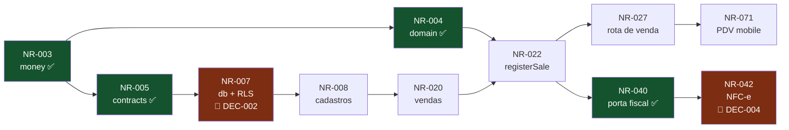

# Task Ledger

Backlog completo dividido em três trilhas. **Fonte da verdade versionada** — o
Monday é a visualização; divergiu, o ledger ganha.

Importação: [`monday-import.csv`](monday-import.csv).

---

## Como ler

| Coluna     | Significado                                                                                                       |
| ---------- | ----------------------------------------------------------------------------------------------------------------- |
| **ID**     | `NR-xxx`, permanente. Aparece na branch, no título do PR, no rodapé do commit e no Monday                         |
| **Trilha** | 🔵 1 Núcleo & Dados · 🟠 2 Plataforma & Integrações · 🟢 3 Clientes                                               |
| **Est**    | estimativa em dias. **Acima de 2 dias, a tarefa deve ser quebrada**                                               |
| **Dep**    | tarefas que precisam estar concluídas antes                                                                       |
| **Bloq**   | o que impede: `DEC-xxx` (decisão em aberto) ou `NR-xxx → DEC-xxx` (dependência travada, com a decisão na raiz)    |
| **Status** | ⬜ a fazer, **pode começar hoje** · 🟨 em andamento · ✅ concluída · 🚧 bloqueada, por decisão ou por dependência |

**⬜ é promessa de que dá para pegar agora.** Tarefa cuja dependência está 🚧
também está 🚧, mesmo que nenhuma decisão fale dela diretamente: `Blocked` no
board é "travada por decisão **ou** dependência"
([rituais](rituais.md#estados-no-monday)), e o planejamento manda que ninguém
comece tarefa bloqueada. Deixá-la ⬜ enche o painel de trabalho que não existe.

**Bloqueado ≠ parado.** Quando o bloqueio é escolha de provedor, a porta e os
testes com adapter falso podem ser escritos antes — é exatamente para isso que
os adapters existem
([princípios](../arquitetura/principios.md#3-adapters-isolam-provedores)).
É por isso que NR-040, NR-043 e NR-045 — as três portas com adapter falso —
dependem de `contracts` (NR-005 ✅) e **não** do caso de uso ou do worker que as
consome. A porta é declarada pelo núcleo; a seta aponta para dentro
([princípio 1](../arquitetura/principios.md#1-core-é-o-núcleo)).

## As trilhas

| Trilha                              | Módulos                                                                              |
| ----------------------------------- | ------------------------------------------------------------------------------------ |
| 🔵 **1 — Núcleo & Dados**           | `money` `domain` `contracts` `db` `core`                                             |
| 🟠 **2 — Plataforma & Integrações** | `api` `worker` `agent` `whatsapp` `fiscal` `banking` `billing` `payments` `infra` CI |
| 🟢 **3 — Clientes**                 | `mobile` `web` `ui`                                                                  |

> **A trilha 1 é o gargalo, e hoje ela está parada.** `money`, `domain` e
> `contracts` já existem. O que falta é `db` — e `db` não começa sem a
> [DEC-002](../decisoes/README.md#dec-002). Não é que a trilha 1 avance pouco:
> ela não tem nenhuma tarefa que possa pegar. Priorize desbloqueá-la sobre
> qualquer outra coisa.

## Painel

|                               | Tarefas | Dias |
| ----------------------------- | ------: | ---: |
| Total                         |      57 |  155 |
| ✅ Concluídas                 |      18 |   36 |
| 🚧 Bloqueadas por decisão     |      13 |   46 |
| 🚧 Bloqueadas por dependência |      25 |   70 |
| ⬜ A fazer, pode começar hoje |       1 |    3 |

> **Números conferidos contra a `main` em 2026-09-02**, não estimados: cada
> ✅ tem commit mesclado com `Refs: NR-xxx` no histórico. O NR-012 é a
> exceção — foi mesclado antes de a convenção de rodapé existir (PR #15).
> As somas saem das linhas deste arquivo e fecham com o
> [`monday-import.csv`](monday-import.csv) que `pnpm ledger:csv` gera.

**Dos 119 dias-desenvolvedor que faltam, 116 não podem começar hoje** — 97% do
trabalho restante. O que sobra são 3 dias, numa tarefa só: o consumidor de fila
(NR-041). Depois dela, **nenhuma tarefa do backlog pode começar** sem que uma
decisão feche.

---

## Sprint 0 — Fundação ✅

| ID     | Tarefa                                                                | Trilha | Módulo         | Est | Dep | Status |
| ------ | --------------------------------------------------------------------- | :----: | -------------- | --: | --- | :----: |
| NR-001 | Workspace pnpm + Turborepo, Docker Compose local, CI, hooks, ESLint   |   🟠   | `repo` `infra` |   3 | —   |   ✅   |
| NR-002 | Base de documentação: produto, arquitetura, engenharia, decisões      |   —    | `docs`         |   4 | —   |   ✅   |
| NR-003 | `packages/money` — centavos, `allocate` sem perda de resto, 21 testes |   🔵   | `money`        |   1 | —   |   ✅   |

## Sprint 1 — Núcleo mínimo

Objetivo: as três trilhas conseguem trabalhar em paralelo sem esperar uma à outra.

| ID     | Tarefa                                                                          | Trilha | Módulo       | Est | Dep    | Bloq                | US/RF                   | Status |
| ------ | ------------------------------------------------------------------------------- | :----: | ------------ | --: | ------ | ------------------- | ----------------------- | :----: |
| NR-004 | `domain`: cálculo de venda — custo, imposto, tarifa de cartão, parcelas         |   🔵   | `domain`     |   3 | NR-003 | —                   | RF-040, RF-041, RF-038  |   ✅   |
| NR-005 | `contracts`: schemas base (Company, Customer, Product, Sale)                    |   🔵   | `contracts`  |   2 | NR-003 | —                   | RNF-027                 |   ✅   |
| NR-006 | Configuração tipada: validar variáveis de ambiente na inicialização             |   🟠   | `repo`       |   1 | NR-001 | —                   | —                       |   ✅   |
| NR-007 | `db`: estratégia multi-tenant, RLS e teste de isolamento                        |   🔵   | `db`         |   3 | NR-005 | **DEC-002**         | RF-121, RF-122, RNF-021 |   🚧   |
| NR-008 | `db`: schema de cadastros (companies, users, customers, products)               |   🔵   | `db`         |   2 | NR-007 | DEC-002             | RF-001, RF-009, RF-017  |   🚧   |
| NR-009 | `api`: base — contexto de execução, erro padronizado, validação por `contracts` |   🟠   | `api`        |   2 | NR-005 | —                   | RNF-027, RNF-054        |   ✅   |
| NR-010 | Qualidade: lint com type-checking e piso de cobertura na CI                     |   🟠   | `repo`       |   1 | NR-001 | —                   | RNF-068                 |   ✅   |
| NR-011 | `ui`: tokens de design (cor, tipografia, espaçamento)                           |   🟢   | `ui`         |   2 | —      | **DEC-001**/QST-011 | RNF-055                 |   ✅   |
| NR-012 | `mobile`: shell de navegação e sessão                                           |   🟢   | `mobile`     |   3 | NR-011 | DEC-008             | US-059                  |   ✅   |
| NR-013 | `web`: shell de layout e sessão                                                 |   🟢   | `web`        |   2 | NR-011 | DEC-008             | US-059                  |   🚧   |
| NR-014 | Autenticação: login, papéis, usuário em várias empresas                         |   🟠   | `api` `core` |   4 | NR-009 | **DEC-008**         | RF-119, RF-120, RF-005  |   🚧   |
| NR-015 | `infra`: definir hospedagem e preencher os workflows de deploy                  |   🟠   | `infra`      |   3 | —      | **DEC-009**         | RNF-064, RNF-013        |   🚧   |

## Sprint 2 — Cadastros e venda

Objetivo: registrar uma venda de ponta a ponta pelo aplicativo.

| ID     | Tarefa                                                                      | Trilha | Módulo         | Est | Dep            | Bloq             | US/RF                  | Status |
| ------ | --------------------------------------------------------------------------- | :----: | -------------- | --: | -------------- | ---------------- | ---------------------- | :----: |
| NR-020 | `db`: schema de vendas e financeiro                                         |   🔵   | `db`           |   3 | NR-008         | NR-008 → DEC-002 | RF-027–044, RF-063     |   🚧   |
| NR-021 | `core`: casos de uso de cadastro (empresa, cliente, produto)                |   🔵   | `core`         |   3 | NR-008         | NR-008 → DEC-002 | RF-001–019             |   🚧   |
| NR-022 | `core`: `registerSale` — transação única com estoque, recebível e auditoria |   🔵   | `core`         |   4 | NR-020, NR-004 | NR-020 → DEC-002 | RF-034–039, RNF-046    |   🚧   |
| NR-023 | `core`: movimentação de estoque e ajuste com autoria                        |   🔵   | `core`         |   2 | NR-021         | NR-021 → DEC-002 | RF-022–024             |   🚧   |
| NR-024 | `domain`: desconto, limite por papel, troco                                 |   🔵   | `domain`       |   2 | NR-004         | —                | RF-030, RF-031, RF-035 |   ✅   |
| NR-025 | `core`: trilha de auditoria somente-inserção                                |   🔵   | `core`         |   2 | NR-020         | NR-020 → DEC-002 | RF-123, RF-124         |   🚧   |
| NR-026 | `api`: rotas de cadastro                                                    |   🟠   | `api`          |   2 | NR-021, NR-009 | NR-021 → DEC-002 | RF-001–019             |   🚧   |
| NR-027 | `api`: rota de venda com chave de idempotência                              |   🟠   | `api`          |   2 | NR-022         | NR-022 → DEC-002 | RF-036, RNF-043        |   🚧   |
| NR-030 | `api`: observabilidade — `requestId`, log estruturado, rastreamento         |   🟠   | `api` `worker` |   2 | NR-009         | —                | RNF-058, RNF-059       |   ✅   |
| NR-070 | `mobile`: cadastro de produto com leitor de código de barras                |   🟢   | `mobile`       |   3 | NR-026         | NR-026 → DEC-002 | US-009, RF-017         |   🚧   |
| NR-071 | `mobile`: carrinho, seleção de cliente e fechamento de venda                |   🟢   | `mobile`       |   5 | NR-027         | NR-027 → DEC-002 | US-014–019             |   🚧   |
| NR-072 | `web`: backoffice de cadastros                                              |   🟢   | `web`          |   3 | NR-026         | NR-026 → DEC-002 | E1, E2, E3             |   🚧   |

## Sprint 3 — Fiscal e financeiro

Objetivo: emitir NFC-e e controlar contas a pagar e receber.

| ID     | Tarefa                                                                 | Trilha | Módulo            | Est | Dep    | Bloq             | US/RF                  | Status |
| ------ | ---------------------------------------------------------------------- | :----: | ----------------- | --: | ------ | ---------------- | ---------------------- | :----: |
| NR-028 | `core`: contas a pagar e a receber, com recorrência                    |   🔵   | `core`            |   3 | NR-020 | NR-020 → DEC-002 | RF-055–067             |   🚧   |
| NR-029 | `core`: baixa, baixa parcial e estorno                                 |   🔵   | `core`            |   2 | NR-028 | NR-028 → DEC-002 | RF-059, RF-066, RF-067 |   🚧   |
| NR-040 | `fiscal`: porta `InvoiceIssuer` + adapter falso                        |   🟠   | `fiscal` `core`   |   2 | NR-005 | —                | RF-045                 |   ✅   |
| NR-041 | `worker`: consumidores de fila (emissão, mensagem, cobrança)           |   🟠   | `worker`          |   3 | NR-040 | —                | RNF-004, RF-130        |   ⬜   |
| NR-042 | `fiscal`: adapter real, contingência e guarda de XML                   |   🟠   | `fiscal`          |   5 | NR-040 | **DEC-004**      | RF-045–054             |   🚧   |
| NR-043 | `payments`: porta `PaymentGateway` + adapter falso                     |   🟠   | `payments` `core` |   2 | NR-005 | —                | RF-063                 |   ✅   |
| NR-044 | `payments`: adapter PagMaxx — Pix, link de pagamento, webhook com HMAC |   🟠   | `payments`        |   4 | NR-043 | DEC-006, DEC-015 | RF-034, RF-068         |   🚧   |
| NR-073 | `mobile`: pagamento, resumo com líquido e margem                       |   🟢   | `mobile`          |   3 | NR-071 | NR-071 → DEC-002 | US-018–020             |   🚧   |
| NR-074 | `web`: contas a pagar e a receber                                      |   🟢   | `web`             |   4 | NR-029 | NR-029 → DEC-002 | E6, E7                 |   🚧   |

## Sprint 4 — WhatsApp e assinatura

Objetivo: operar o ERP por mensagem e cobrar a mensalidade.

| ID     | Tarefa                                                        | Trilha | Módulo            | Est | Dep            | Bloq             | US/RF                  | Status |
| ------ | ------------------------------------------------------------- | :----: | ----------------- | --: | -------------- | ---------------- | ---------------------- | :----: |
| NR-031 | `core`: exportação completa e anonimização (LGPD)             |   🔵   | `core`            |   3 | NR-028         | NR-028 → DEC-002 | RF-125–128             |   🚧   |
| NR-045 | `whatsapp`: porta `MessageSender` + adapter falso             |   🟠   | `whatsapp` `core` |   2 | NR-005         | —                | RF-015                 |   ✅   |
| NR-046 | `whatsapp`: adapter real, webhook e consentimento             |   🟠   | `whatsapp`        |   4 | NR-045         | **DEC-003**      | RF-016, RF-094, RF-095 |   🚧   |
| NR-060 | `agent`: runtime com tools geradas de `contracts`             |   🟠   | `agent`           |   5 | NR-046, NR-005 | **DEC-007**      | RF-096–102             |   🚧   |
| NR-061 | `agent`: confirmação de ação sensível, com expiração          |   🟠   | `agent`           |   2 | NR-060         | NR-060 → DEC-007 | RF-103, RF-104         |   🚧   |
| NR-062 | `agent`: contexto de conversa isolado por empresa             |   🟠   | `agent`           |   3 | NR-060         | **DEC-011**      | RF-105, RF-106         |   🚧   |
| NR-063 | `billing`: assinatura, trial, inadimplência e estado restrito |   🟠   | `billing`         |   4 | NR-044         | **DEC-010**      | RF-110–118             |   🚧   |
| NR-075 | `web`: planos, assinatura e cupom                             |   🟢   | `web`             |   3 | NR-063         | DEC-012          | E12                    |   🚧   |

## Sprint 5 — Bancos e relatórios

| ID     | Tarefa                                                         | Trilha | Módulo         | Est | Dep    | Bloq             | US/RF          | Status |
| ------ | -------------------------------------------------------------- | :----: | -------------- | --: | ------ | ---------------- | -------------- | :----: |
| NR-032 | `core`: plano de contas, classificação e DRE simplificado      |   🔵   | `core`         |   4 | NR-028 | NR-028 → DEC-002 | RF-081–088     |   🚧   |
| NR-033 | `core`: conciliação com sugestão por valor e data              |   🔵   | `core`         |   3 | NR-032 | NR-032 → DEC-002 | RF-078–080     |   🚧   |
| NR-047 | `banking`: importação de OFX/CSV                               |   🟠   | `banking`      |   3 | NR-033 | NR-033 → DEC-002 | RF-076, RF-077 |   🚧   |
| NR-048 | `banking`: Open Finance                                        |   🟠   | `banking`      |   4 | NR-047 | **DEC-005**      | RF-074, RF-075 |   🚧   |
| NR-076 | `web`: conciliação bancária                                    |   🟢   | `web`          |   3 | NR-033 | NR-033 → DEC-002 | US-038         |   🚧   |
| NR-077 | Relatórios: DRE, ranking e faturamento, no app e no assistente |   🟢   | `web` `mobile` |   4 | NR-032 | NR-032 → DEC-002 | US-041, US-053 |   🚧   |

## Backlog

| ID     | Tarefa                                               | Trilha | Módulo   | Est | Dep    | Bloq             | US/RF          | Status |
| ------ | ---------------------------------------------------- | :----: | -------- | --: | ------ | ---------------- | -------------- | :----: |
| NR-016 | `CHANGELOG` gerado dos commits + processo de release |   🟠   | `repo`   |   1 | —      | —                | —              |   ✅   |
| NR-034 | `core`: agenda e lembretes                           |   🔵   | `core`   |   2 | —      | —                | RF-089–093     |   ✅   |
| NR-035 | `db`: schema de agenda (`appointments`)              |   🔵   | `db`     |   1 | NR-008 | NR-008 → DEC-002 | RF-089, RF-090 |   🚧   |
| NR-036 | `api`: rotas de agenda                               |   🟠   | `api`    |   1 | NR-035 | NR-035 → DEC-002 | RF-089–093     |   🚧   |
| NR-049 | E2E do caminho crítico (3 fluxos)                    |   🟠   | `repo`   |   3 | NR-071 | NR-071 → DEC-002 | RNF-068        |   🚧   |
| NR-078 | `mobile`: agenda                                     |   🟢   | `mobile` |   2 | NR-036 | NR-036 → DEC-002 | US-043–045     |   🚧   |
| NR-079 | `web`: conteúdo real da landing                      |   🟢   | `web`    |   1 | —      | —                | —              |   ✅   |

---

## Caminho crítico

O que atrasa o MVP inteiro se atrasar:

**NR-007 é o nó mais crítico do projeto.** Ele bloqueia todo o schema, e está
travado por [DEC-002](../decisoes/README.md#dec-002). `domain` (NR-004) e
`contracts` (NR-005) já estão prontos — então, enquanto essa decisão não fechar,
a trilha 1 **não tem nenhuma tarefa disponível**. As outras duas ficam com o que
não depende de schema: o consumidor de fila (NR-041), 3 dias — e mais nada
depois dele.

**Prazo real para DEC-002: 5 dias úteis a partir do início da Sprint 1.**

## Bloqueios por decisão

| Decisão                                                                           | Diretas        | Em cascata | Dias parados |
| --------------------------------------------------------------------------------- | -------------- | ---------: | -----------: |
| [DEC-002](../decisoes/README.md#dec-002) multi-tenant                             | NR-007, NR-008 |         24 |           73 |
| [DEC-007](../decisoes/README.md#dec-007) LLM                                      | NR-060         |          1 |            7 |
| [DEC-008](../decisoes/README.md#dec-008) autenticação                             | NR-013, NR-014 |          — |            6 |
| [DEC-004](../decisoes/README.md#dec-004) fiscal                                   | NR-042         |          — |            5 |
| [DEC-003](../decisoes/README.md#dec-003) WhatsApp                                 | NR-046         |          — |            4 |
| [DEC-010](../decisoes/README.md#dec-010) cobrança                                 | NR-063         |          — |            4 |
| [DEC-006](../decisoes/README.md#dec-006)/[015](../decisoes/README.md#dec-015) PSP | NR-044         |          — |            4 |
| [DEC-005](../decisoes/README.md#dec-005) Open Finance                             | NR-048         |          — |            4 |
| [DEC-009](../decisoes/README.md#dec-009) hospedagem                               | NR-015         |          — |            3 |
| [DEC-011](../decisoes/README.md#dec-011) contexto da conversa                     | NR-062         |          — |            3 |
| [DEC-012](../decisoes/README.md#dec-012) usuário e cupons                         | NR-075         |          — |            3 |
| [DEC-001](../decisoes/README.md#dec-001) nome/marca                               | — (NR-011 ✅)  |          — |            0 |

**116 dos 119 dias-desenvolvedor restantes estão bloqueados por 12 decisões** —
97% do que falta. Decidir é, hoje, a atividade de maior retorno do projeto,
mais do que escrever código.

Cada tarefa é contada **uma vez**, na decisão que aparece na sua própria coluna
`Bloq`. Uma tarefa pode estar atrás de mais de uma: NR-048 espera a DEC-005 e,
via NR-047, também a DEC-002 — somar as duas contaria o mesmo dia duas vezes.

**A DEC-002 responde por 73 dos 116 dias — 63% de todo o bloqueio.** Nenhuma
outra chega perto: fechar as onze restantes e deixar essa aberta libera 43 dias;
fechar só ela libera 73.

A [DEC-001](../decisoes/README.md#dec-001) não trava mais tarefa nenhuma. NR-011
foi entregue com a paleta provisória de
[`packages/ui/src/tokens/color.ts`](../../packages/ui/src/tokens/color.ts) — a
mitigação que estava prevista. O custo dela deixou de ser trabalho parado e
passou a ser retrabalho: trocar os tokens quando a marca fechar.

## Carga por trilha

| Trilha                          | Tarefas | Dias | Observação                                        |
| ------------------------------- | ------: | ---: | ------------------------------------------------- |
| 🔵 1 — Núcleo & Dados           |      18 |   45 | é o gargalo, e hoje sem nenhuma tarefa disponível |
| 🟠 2 — Plataforma & Integrações |      25 |   68 | a mais carregada e a mais bloqueada (9 decisões)  |
| 🟢 3 — Clientes                 |      13 |   38 | o que falta dela está todo atrás de schema        |
| Compartilhada                   |       1 |    4 | documentação (NR-002)                             |

Somando: **155 dias-desenvolvedor** em 57 tarefas. Com 3 pessoas, isso é cerca
de 10 semanas de trabalho — desde que nada fique bloqueado, o que não é o caso
hoje.

A trilha 3 não está mais ociosa por falta de `ui`: NR-011 e NR-012 saíram com a
paleta provisória. O que a trava agora é schema — de NR-020 em diante, tudo o
que resta dela depende dele.

## Convenções

| Regra                                           | Motivo                                                   |
| ----------------------------------------------- | -------------------------------------------------------- |
| Tarefa acima de 2 dias é quebrada               | estimativa grande é estimativa errada                    |
| Toda tarefa tem `US-xxx` ou `RF-xxx`            | trabalho sem requisito é trabalho sem critério de pronto |
| Tarefa bloqueada referencia a `DEC-xxx`         | e a `DEC` referencia a tarefa de volta                   |
| ID nunca é reaproveitado                        | tarefa cancelada fica como cancelada; o número queima    |
| Tarefa com dependência 🚧 também é 🚧           | ⬜ promete que dá para começar hoje                      |
| Painel e cargas conferem com as linhas          | soma errada é pior que soma nenhuma                      |
| Este arquivo é atualizado **no PR**, não depois | ledger desatualizado é pior que ledger nenhum            |

## Documentos relacionados

- [`monday-import.csv`](monday-import.csv) — o mesmo ledger, para importar
- [Rituais](rituais.md) — DoR, DoD, cerimônias
- [Fluxo de trabalho](../engenharia/fluxo-de-trabalho.md) — o ciclo de uma tarefa
- [Decisões](../decisoes/README.md) — o que está bloqueando
